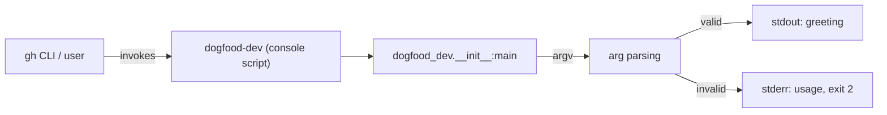

# SPEC: dogfood-dev

*Approved 2026-07-06.*

## Architecture overview

Single-module Python CLI. No services, no network calls, no persistence. The entire system
is one process that parses argv and prints to stdout/stderr.

## Components

- **`dogfood_dev` package** (`src/dogfood_dev/__init__.py`): owns `main()`, argument parsing,
  and greeting formatting. Sole component; no internal layering needed at this size.
- **`dogfood_dev.__main__`**: thin `python -m dogfood_dev` entry, delegates to `main()`.
- **Console script** `dogfood-dev` (`pyproject.toml` `[project.scripts]`): production entry
  point, delegates to `main()`.

## Contracts

`main()` reads `sys.argv`. Flags, all optional and composable except `--version`:

| Flag | Effect | Notes |
|---|---|---|
| *(none)* | stdout: `Hello, World!` + newline, exit 0 | current behavior, unchanged |
| `--name NAME` | stdout: `Hello, {NAME}!` + newline, exit 0 | replaces `World`; `NAME` taken verbatim, no escaping/sanitization needed (local CLI, not a security boundary) |
| `--shout` | uppercases the entire greeting output | composes with `--name`: `--name ada --shout` -> `HELLO, ADA!` |
| `--version` | stdout: the installed package version (read via `importlib.metadata.version("dogfood-dev")`), exit 0 | short-circuits: ignores `--name`/`--shout` if also passed |
| unknown flag / bad usage | stderr: a one-line usage message, exit code 2 | exact wording is an implementation choice; the exit code (2) and stream (stderr) are the frozen contract |

No config files, no environment variables, no stdin reading.

## Data model

None. No entities, no persistence, no migrations.

## Non-functional requirements

- Startup-to-output latency: no explicit floor: a Python CLI printing one line has no
  measurable perf requirement at this scale.
- Python: `>=3.14` (pinned in `pyproject.toml`, matches the runtime already installed via `uv`).
- No availability/uptime requirement (not a running service).

## Security model

No authn/authz, no secrets, no user data. `--name` accepts arbitrary text printed verbatim to
stdout; not a template/shell context, so no injection surface.

## Negative requirements

(from PRD non-goals)

- The CLI must NOT grow user-facing polish, packaging/distribution tooling, or a versioning
  policy beyond what a milestone task explicitly requires; additions exist only to produce
  credible small task packets for tracker-backend testing.
- Must NOT depend on Linear or the local file tracker backend; this project validates the
  GitHub Issues backend only.
- Must NOT add the automatic PR-review GitHub Action (`review_action: false` stands; no
  `ANTHROPIC_API_KEY` configured). Review stays manual `/dev:review-pr`.
- Must NOT introduce concurrency, multi-session claim-race scenarios, or any dependency on
  more than one developer/session acting at once.

## Development environment

- Language: Python 3.14, managed via `uv` (see `~/.claude/rules/python.md`-equivalent
  conventions: `uv run`, `uv add`, never bare `pip`).
- Test runner: `pytest`, invoked as `uv run pytest`.
- Package layout: `src/` layout, `uv_build` backend, console script `dogfood-dev`.
- Lint/format: none configured; not required by any milestone-1 task.

## Deployment architecture

None. Not deployed anywhere; runs locally via `uv run dogfood-dev` or the installed console
script. CI (`.github/workflows/ci.yml`) runs `uv run pytest` on push/PR to `main`. CI's
purpose here is exclusively to produce the pass/fail signal that `dev:execute`/`dev:verify`
consume, not to gate a deployment.

## Milestone-1 test-scenario tasks

Two of the milestone's feature tasks additionally serve as tracker-backend test vehicles
(per `docs/PRD.md` Goals 2-4). `docs/ROADMAP.md` names which task carries which scenario;
the exact seeding mechanism (how a CI failure is deliberately introduced, and what makes a
DoD criterion non-mechanical) is a `dev:plan` packet-drafting decision, not a contract fixed
here; only the *existence* of one recoverable-CI-failure task, one exhausting-CI-failure
task, and one manual-DoD task is fixed.
