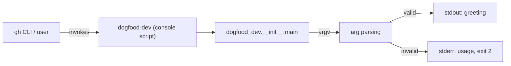

# SPEC: dogfood-dev

*Approved 2026-07-06. Milestone 2 delta approved 2026-07-06 (see Change log, ADR-001).*

## Architecture overview

Single-module Python CLI. No services, no network calls, no persistence. The entire system
is one process that parses argv and prints to stdout/stderr.

## Components

- **`dogfood_dev` package** (`src/dogfood_dev/__init__.py`): owns `main()`, argument parsing,
  and greeting formatting. Sole component; no internal layering needed at this size.
- **`dogfood_dev.__main__`**: thin `python -m dogfood_dev` entry, delegates to `main()`.
- **Console script** `dogfood-dev` (`pyproject.toml` `[project.scripts]`): production entry
  point, delegates to `main()`.

## Contracts

`main()` reads `sys.argv`. Flags, all optional and composable except `--version`:

| Flag | Effect | Notes |
|---|---|---|
| *(none)* | stdout: `Hello, World!` + newline, exit 0 | current behavior, unchanged |
| `--name NAME` | stdout: `Hello, {NAME}!` + newline, exit 0 | replaces `World`; `NAME` taken verbatim, no escaping/sanitization needed (local CLI, not a security boundary) |
| `--shout` | uppercases the entire greeting output | composes with `--name`: `--name ada --shout` -> `HELLO, ADA!` |
| `--version` | stdout: the installed package version (read via `importlib.metadata.version("dogfood-dev")`), exit 0 | short-circuits: ignores `--name`/`--shout` if also passed |
| unknown flag / bad usage | stderr: a one-line usage message, exit code 2 | exact wording is an implementation choice; the exit code (2) and stream (stderr) are the frozen contract |
| `--repeat N` | stdout: the greeting printed N times, one per line, exit 0 | `N` a positive integer (`>=1`); non-positive or non-integer `N` is bad usage (exit 2); composes with `--name`/`--shout` per the existing pattern; composition with the other Milestone-2 flags below is unspecified (each is single-concern, independent) |
| `--json` | stdout: `{"message": "<greeting>"}` (the would-be plain-text greeting), exit 0 | composes with `--name`/`--shout`; incompatible with `--repeat` (bad usage, exit 2, if both given) |
| `--pad N` | stdout: the greeting with `N` literal space characters on each side, exit 0 | `N` a non-negative integer; invalid `N` is bad usage (exit 2); composes with `--name`/`--shout` |
| `--color {red,green,blue,yellow}` | stdout: the greeting wrapped in the ANSI escape code for the chosen color plus a reset code | invalid color name is bad usage (exit 2, existing row); composes with `--name`/`--shout` |
| `--farewell` | stdout: swaps `Hello` for `Goodbye` in the greeting, exit 0 | composes with `--name`/`--shout` per the existing pattern |

No config files, no environment variables, no stdin reading.

## Data model

None. No entities, no persistence, no migrations.

## Non-functional requirements

- Startup-to-output latency: no explicit floor: a Python CLI printing one line has no
  measurable perf requirement at this scale.
- Python: `>=3.14` (pinned in `pyproject.toml`, matches the runtime already installed via `uv`).
- No availability/uptime requirement (not a running service).

## Security model

No authn/authz, no secrets, no user data. `--name` accepts arbitrary text printed verbatim to
stdout; not a template/shell context, so no injection surface.

## Negative requirements

(from PRD non-goals)

- The CLI must NOT grow user-facing polish, packaging/distribution tooling, or a versioning
  policy beyond what a milestone task explicitly requires; additions exist only to produce
  credible small task packets for tracker-backend testing.
- Must NOT depend on the local file tracker backend; that checklist item already passed on
  `dogfood-local`. (Milestone 1 was GitHub-Issues-only; Milestone 2 adds Linear — see
  ADR-001 and the Change log below.)
- Must NOT add the automatic PR-review GitHub Action (`review_action_installed: false`
  stands; no `ANTHROPIC_API_KEY` configured). Review stays manual `/dev:review-pr`.
- Must NOT introduce true multi-session/concurrent claim-race testing: the Linear claim
  guard (Milestone 2) is proven as a single-session write-then-re-read code-path check, not
  by racing two coordinated sessions (see ADR-001, PRD Non-goals).

## Development environment

- Language: Python 3.14, managed via `uv` (see `~/.claude/rules/python.md`-equivalent
  conventions: `uv run`, `uv add`, never bare `pip`).
- Test runner: `pytest`, invoked as `uv run pytest`.
- Package layout: `src/` layout, `uv_build` backend, console script `dogfood-dev`.
- Lint/format: none configured; not required by any milestone-1 task.

## Deployment architecture

None. Not deployed anywhere; runs locally via `uv run dogfood-dev` or the installed console
script. CI (`.github/workflows/ci.yml`) runs `uv run pytest` on push/PR to `main`. CI's
purpose here is exclusively to produce the pass/fail signal that `dev:execute`/`dev:verify`
consume, not to gate a deployment.

## Milestone-1 test-scenario tasks

Two of the milestone's feature tasks additionally serve as tracker-backend test vehicles
(per `docs/PRD.md` Goals 2-4). `docs/ROADMAP.md` names which task carries which scenario;
the exact seeding mechanism (how a CI failure is deliberately introduced, and what makes a
DoD criterion non-mechanical) is a `dev:plan` packet-drafting decision, not a contract fixed
here; only the *existence* of one recoverable-CI-failure task, one exhausting-CI-failure
task, and one manual-DoD task is fixed.

## Milestone-2 test-scenario tasks

Per `docs/PRD.md` Goals 6-10 (Linear backend, `dev:backlog` flows, unattended safeguards,
retro benefit). `docs/ROADMAP.md` names the scenario requirements; as with Milestone 1, the
exact task count, sequencing, and seeding mechanism are `dev:plan` packet-drafting decisions,
not fixed here. Fixed by this spec:

- At least one task moves through the full Linear workflow-state lifecycle
  (`Backlog → Todo → In Progress → In Review → Done`) via `dev:execute` → `dev:review-pr` →
  `dev:verify`, on team `DOG`, with the claim step's write-then-re-read guard exercised
  (single-session; see Negative requirements).
- At least one task is created via `dev:backlog` one-off intake (not from the milestone's
  original `dev:plan` dry-run) with a full packet.
- At least one ticket is created manually (directly in the Linear UI, incomplete packet) and
  is caught and completed by `dev:execute`'s packet-validation step at claim time.
- At least one task demonstrates an explicit `Backlog → Todo` promotion and one demonstrates
  a `Wont Do` closure with a surviving rationale comment.
- At least one request is deliberately spec-impacting and is correctly routed by
  `dev:backlog` to a `dev:architect` delta rather than actioned directly.
- Enough tasks reach `In Progress`/`In Review` simultaneously (at or above
  `work_in_progress_limit`) for a `/loop /dev:execute` batch run to observably hit the gate
  and idle, without requiring true multi-session concurrency (sequential unmerged
  in-review tasks satisfy the count).
- At least one task is deliberately constructed to exhaust `max_fix_attempts` and land in
  `Blocked` with a diagnostic comment (mirrors Milestone 1's exhausting-CI-failure task, now
  on the Linear backend).
- `dev:retro` runs on a completed Milestone-2 task, proposes a rule/CLAUDE.md promotion from
  real evidence, the promotion is applied, and a subsequent task's `dev:execute` session
  visibly follows it.

## Change log

- **2026-07-06** — Delta via `/dev:backlog` → `/dev:architect` (spec-impacting: Milestone 2
  request, following the approved PRD delta). Changed: Negative requirements (lifted the
  blanket Linear exclusion; local-backend and true-concurrency exclusions restated
  precisely), added "Milestone-2 test-scenario tasks" section. See ADR-001 for the
  tracker-backend-switch decision. `docs/ROADMAP.md` gets a matching Milestone 2 section.
- **2026-07-06** — Delta via `/dev:plan` (spec gap found while drafting Milestone 2 packets:
  no Contract rows existed for any new small feature to serve as a Milestone-2 task vehicle).
  Added Contracts rows: `--repeat N`, `--json`, `--pad N`, `--color`, `--farewell`. No ADR:
  trivial additions, no contested tradeoff. `--pad N` is the designated exhausting-CI-failure
  vehicle (mirrors Milestone 1's `--version` role).
